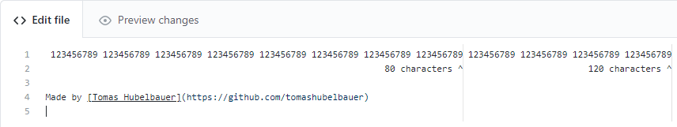

# GitHub 80/120 Characters

To make the GitHub code editor display an 80 and 120 character cutoff lines, use
the stylesheet in [`background.css`](background.css).



This is what displaying the following text in the GitHub editor looks like:

```
 123456789 123456789 123456789 123456789 123456789 123456789 123456789 123456789 123456789 123456789 123456789 123456789
                                                                 80 characters ^                        120 characters ^

Made by [Tomas Hubelbauer](https://github.com/tomashubelbauer)

```

## Installation & Usage

You can use the [Stylus](https://github.com/openstyles/stylus) extension to use
the stylesheet.

See about [User Stylesheet Support In Browsers](#user-stylesheets-in-browsers)
for why to use the extension.

## User Stylesheets In Browsers

Unfortunately, user stylesheets as a browser feature are not really something
browsers do in a user-friendly way anymore:

- [Chrome/Edge](https://src.chromium.org/viewvc/chrome?revision=234007&view=revision)
- [Firefox](https://superuser.com/a/319322/490452)

## Browser Extension

I am working on developing a browser extension specifically for this so that
people are not forced to give an extension full access to all their tabs.

The extension will support Firefox and Chrome.

### Firefox

- Go to `about:debugging#/runtime/this-firefox`
- Click **Load Temporary Add-On** and select `manifest.json`
- Click **Reload** after making changes
- Click **Inspect** to view the extension console

### Chrome

The Chrome extension is being developed and tested using Puppeteer.

```
npm install
node . $password
```

`$password` is a password to the collaborator `github-80-120@hubelbauer.net`
GitHub account with access to the repository. This is needed so the account can
enter the edit mode of the `readme.md` MarkDown document.

To use Chrome directly and not through Puppeteer:

- Go to chrome://extensions
- Switch **Developer mode** on
- Click **Load unpacked** and select this repository directory
- Click the reload icon after making changes
- Click **Details** > `background page` to view the extension console

## To-Do

### Publish the extension for Firefox

https://extensionworkshop.com/documentation/publish/submitting-an-add-on

### Publish the extension for Chrome and Edge

https://developer.chrome.com/docs/webstore/publish

### Publish the extension for Edge

https://docs.microsoft.com/en-us/microsoft-edge/extensions-chromium/publish/publish-extension

### Run the Puppeteer script in GitHub Actions and push `screenshot.png` from it

### Fix or workaround GitHub not updating the `screenshot.png` image on push
